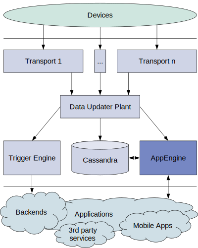

Astarte App Engine
==================

** astarte_appengine_api has been moved to
https://github.com/astarte-platform/astarte/tree/master/apps/astarte_appengine_api ** .

This repository has been archived, development is no longer happening here.

New [issues](https://github.com/astarte-platform/astarte/issues) or
[pull requests](https://github.com/astarte-platform/astarte/pulls) should be opened against
[astarte](https://github.com/astarte-platform/astarte) main repository.

Astarte App Engine serves a [REST API](priv/static/astarte_appengine_api.yaml) that allows applications to gather and send data to the devices fleet.

REST API documentation can be viewed at http://appenginehost:4002/swagger/ .
